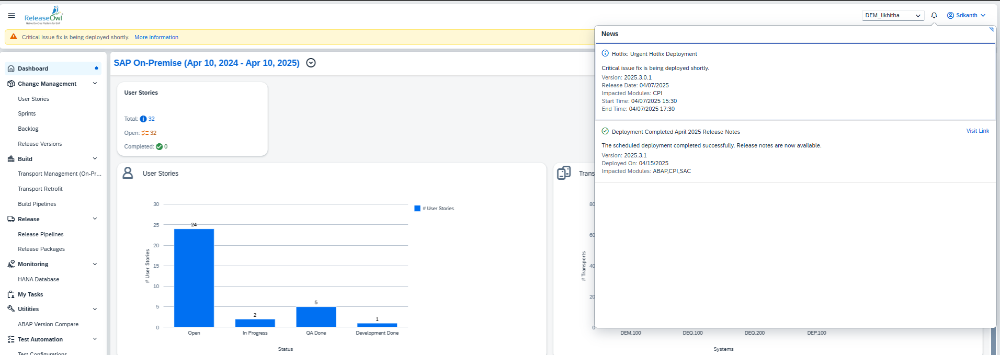

# User & Role Management

ReleaseOwl provides two distinct views for users:

### 1. Project View

* **Access:** Available to all users.
* &#x20;**Purpose:** Allows users to manage and monitor specific projects based on their assigned permissions.

### 2. Administration View

* &#x20;**Access:** Restricted to admin users created during the customer's provisioning process.
* &#x20;**Purpose:** Enables administrators to manage all aspects of the platform, including projects, users, credentials, environments and settings.

### **Accessing the Administration View**

To access the Administration View, follow these steps:

1. Log in to ReleaseOwl as an admin user.
2. Click on the **Administration** menu link located at the bottom left corner of the Home page.
3. Upon clicking **Administration**, a comprehensive list of all projects available to the client will be displayed.

<figure><figcaption></figcaption></figure>

### User Management

The User Management functionality within the **Administration View** comprises two main features:

#### 1. Manage Users

This functionality allows administrators to effectively oversee and control user access within the system.

#### License Overview

Provides insights into the number of licenses across the following categories:

* User License
* Admin Licenses

Displays the total, used, and available licenses, facilitating efficient resource management.

<figure><figcaption></figcaption></figure>

#### User Details

Lists all registered users along with the following details:

* **User Type**: Specifies whether the user is an **Admin** or **Standard User**.

<figure><figcaption></figcaption></figure>

#### Create User

This section explains how to create a new user and configure the required roles, environments, and project access.

To create a new user:

1. Navigate to the **Users** section.
2. Click the **Create** button to add a new user.

<figure><figcaption></figcaption></figure>

3. The **User Creation form** will open. Enter the required user details in the provided fields.
4. Click the **Create** button to save the user.

<figure><figcaption></figcaption></figure>

5. Once the user is created, the **newly created user will appear in the Users Details list**.

<figure><figcaption></figcaption></figure>

**Managing User Details**

* Click the **arrow ( > ) icon** next to the user to open the **user details page**.

<figure><figcaption></figcaption></figure>

* In this section, you can:
  * Assign **Projects** to the user.
  * Assign **Roles** required for performing actions in the system.
  * Configure **Environment access** for the user.
* After assigning the necessary roles and access permissions, click **Save** to confirm the configuration.

<figure><figcaption></figcaption></figure>

**Editing User Information**

If changes are required:

* Click the **Edit** button available under the **Actions** column.
* Modify the required user details.
* Click **Save** to apply the updates.

<figure><figcaption></figcaption></figure>

#### Lock&#x20;

The **Lock** feature allows administrators to control access to the system for selected users. When a user is locked, they are prevented from logging in or performing any operations until their access is restored.

**To perform the Lock operation:**

1. Select one or more users by clicking the checkbox beside their names.
2. Click the **Lock** button.
3. The selected users will be locked and denied access to the system until unlocked.

<figure><figcaption></figcaption></figure>

**Unlock**

The **Unlock** feature allows administrators to restore access to users who were previously locked. Once unlocked, users can log in and resume their activities in the system.

**To perform the Unlock operation:**

1. Select one or more users by clicking the checkbox beside their names.
2. Click the **Unlock** button.&#x20;
3. The selected users will regain access to the system.

<figure><figcaption></figcaption></figure>

**Show**

It allows users to filter and view the user list based on their role or status, such as Admin, User or Locked Users.

<figure><figcaption></figcaption></figure>

**Filter**

It is used to search for users based on their **name** or **email ID**.

<figure><figcaption></figcaption></figure>

### Manage Roles

The Manage Roles feature in the Administration View allows administrators to create, edit, and delete roles to manage user privileges within the platform.

#### Create Role

To create a new role:

1. Click on the **Create Role** button located at the top right corner of the screen.
2. Fill in the required details, such as the **Role Name** and **Description**.
3. Click **Save** to create the new role.

<figure><figcaption></figcaption></figure>

4. Duplicate role names are not allowed. If the role name already exists, you will be prompted to enter a unique name.

<figure><figcaption></figcaption></figure>

4. The newly created role will appear in the list of available roles.

<figure><figcaption></figcaption></figure>

#### Assign Role Actions

To assign the role actions to an existing role:

1. Click the **Edit** icon next to the role name.

<figure><figcaption></figcaption></figure>

2. A detailed **Role Actions** screen will be displayed, showing all available permissions organized by categories such as Transport Management, Change Management, CPI Management, and more.
3. Select or update the required permissions for the role.

<figure><figcaption></figcaption></figure>

4\. Once all role actions are configured as required, click the **Save** button at the top right corner of the screen.

<figure><figcaption></figcaption></figure>

### **Notification Bar in ReleaseOwl**

To keep users informed and up to date, ReleaseOwl includes a **Notification Bar** feature that displays important system messages directly within the application interface.

<figure><figcaption></figcaption></figure>
