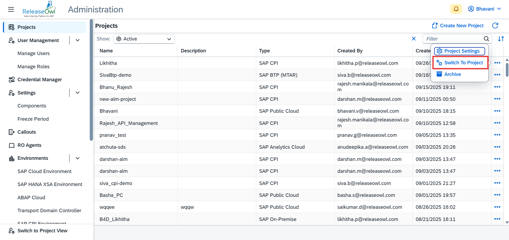

# Reports

The **Reports** section is available within the **Project View** and provides comprehensive insights into deployment activities. It includes two key reports:

* **Deployment Reports**
* **Task Reports**

These reports help teams monitor deployment progress, validate successful deployments, and maintain traceability across environments.

### Deployment Report

The **Deployment Report** offers detailed visibility into the deployment status of user stories, Transports, CPI  within a selected project.

**How to Generate the Report:**

1. Navigate to the **Reports** section in the **Project View**.
2. Click on the type of the user story that you want to do.

<figure><figcaption></figcaption></figure>

3. Select the following parameters:

* **From Date**
* **End Date**
* **Environment**
* **Target System**

4. Click **GO** to generate the report.

<figure><figcaption></figcaption></figure>

**Report Details:**

The generated report displays:

* User Story identifiers
* Deployment date and time
* Environment and Target System details
* Deployment status

This report helps teams track user story deployments and confirm successful completion. You can also export the report via PDF or Excel.&#x20;

<figure><figcaption></figcaption></figure>

### Tasks

The **Task Report** provides an overview of all the tasks of the user story, transports and CPI.&#x20;

**How to Generate the Report:**

1. Go to the **Reports** section in the **Project View**.
2. Click on **Task Reports** &#x20;

<figure><figcaption></figcaption></figure>

3. Select the following parameters:

* **From Date**
* **End Date**

4. Click **GO** to generate the report. It provides details of releasepipeline, tasksource, assigne and action.&#x20;

<figure><figcaption></figcaption></figure>

