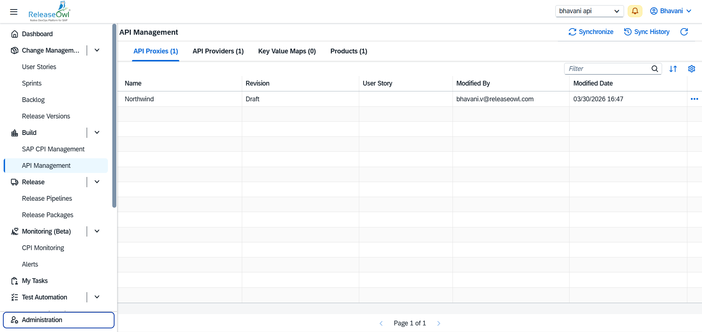

# API Management

The **API Management** module in ReleaseOwl provides a comprehensive set of tools to streamline the management of SAP API artifacts. From synchronizing and configuring API proxies to tracking revisions and managing deployments across environments, this module ensures efficient control over your API landscape. It supports artifact promotion, revision history tracking, deployment validation, and environment-specific configurations.

### Synchronize API Artifacts

To sync API artifacts from SAP API Management:

1. Navigate to the **Project View**.
2. Under the **Build** section, click on **API Management (Beta)**.

<figure><figcaption></figcaption></figure>

3. Click the **Synchronize** button to retrieve the available API artifacts based on the selected tab. The following artifact types are supported:

* **API Proxies**
* **Key Value Maps**
* **API\_Product**
* **API\_Providers**

4. These artifacts are retrieved from the registered SAP API Management environment and reflected within ReleaseOwl.

<figure><figcaption></figcaption></figure>

#### Sync History

To track previous synchronizations:

* Click on **Sync History** to view a detailed log of all synchronization activities performed within the project.

<figure><figcaption></figcaption></figure>

### **Artifact Actions**

Based on the type of artifact, the following actions are available:

* **Sync** – Re-fetch the latest version of the artifact.
* **Configure** – Modify environment-specific configuration parameters.
* **Revisions** – View available revisions of the artifact.
* **Deployment History** – Track deployment activity across stages.
* **Download** –Download the API Proxy as a ZIP file for backup or inspection.

#### **API Proxies**

The **API Proxies** section in ReleaseOwl allows users to view, synchronize, and configure API Proxy artifacts retrieved from the integrated SAP API Management environments.

**Sync:**&#x20;

The **Sync** option is used to fetch the latest version of API Proxy artifacts from the registered SAP API Management environment.

* Click **Sync** to refresh and retrieve the most up-to-date API Proxy definitions.
* This ensures that ReleaseOwl reflects the current state of artifacts across environments.

<figure><figcaption></figcaption></figure>

**To configure an API artifact:**

To configure an API Proxy artifact in ReleaseOwl:

1. Navigate to the **API Proxies** tab.
2. Locate the required API Proxy.
3. Click the **Actions** button.
4. Select **Configure**.&#x20;

<figure><figcaption></figcaption></figure>

#### Configuration Screen

The configuration view displays the selected API Proxy across multiple SAP API Management environments (e.g., QA, Production) that are part of the deployment landscape.


**Note:** The **Development (Dev) environment is read-only** and does not allow modification.


**Updating Environment-Specific Parameters**

To modify configuration values for non-Dev environments:

1. Click the **Edit (pencil) icon** next to the desired field.
2. Update the required parameters.
3. Click **Save** to persist changes.

<figure><figcaption></figcaption></figure>

**Target EndPoints Configuration**

Use the **Target EndPoint** tab to define and manage backend endpoint values for each named target endpoint.

1. Select the appropriate **Target Endpoint** from the dropdown.
2. Modify fields such as the following by using the **Edit (pencil)** icon next to each field:
   * `url`
   * `provider_id`
   * `relativePath`
   * `targetAPIProxyName`
3. Click the **Save** button to persist the changes for the selected target endpoint.

This configuration is deployed during the API Proxy deployment.

<figure><figcaption></figcaption></figure>


**Definition:** A _**Target Endpoint**_ is the backend service to which the API Proxy forwards client requests. The client interacts with the proxy URL, and the request is internally routed to the defined target endpoint.


**Host Alias Configuration**

The **Host Alias** tab allows you to define environment-agnostic logical mappings for backend hostnames, enhancing flexibility during API deployments.

To configure host aliases:

1. Navigate to the **Host Alias** tab.
2. Click the **Edit** button.

<figure><figcaption></figcaption></figure>

3. In your target environment, multiple host aliases may be configured. If you want to deploy your API proxy to a specific host alias, you can specify the desired host alias in the **Configure** section.
4. Save your configuration by clicking the **Save** button.

<figure><figcaption></figcaption></figure>

### API Provider

The **API Provider** section in ReleaseOwl is used to configure provider-specific parameters that define how API artifacts interact with backend services across different environments.

<figure><figcaption></figcaption></figure>

**Synchronization**

The **Sync** option allows users to fetch the latest API Provider configurations from the registered SAP API Management environment.

* Click **Sync** to retrieve the most recent provider entries.
* This ensures that the configuration in ReleaseOwl is up to date with the source environment.

<figure><figcaption></figcaption></figure>

#### Configuring an API Provider

To configure an API Provider in ReleaseOwl:

1. Navigate to the **API Provider** tab.
2. Select the required provider entry.
3. Click the **Actions** button.
4. Select **Configure**.

<figure><figcaption></figcaption></figure>

#### Configuration Screen

The configuration screen displays the API Provider entries across multiple environments (e.g., QA, Production) that are part of the deployment landscape. Each provider configuration is represented as **entries**, where environment-specific values can be maintained.

<figure><figcaption></figcaption></figure>


**Note:** The **Development (Dev) environment is read-only** and cannot be modified.


#### Key Value Maps 

The **Key Value Maps (KVM)** section in ReleaseOwl is used to manage environment-specific key-value pairs that are consumed by API Proxies at runtime. Each KVM consists of multiple **keys**, with corresponding **values maintained per environment** (e.g., Dev, QA, Prod).

<figure><figcaption></figcaption></figure>

**Synchronization**

The **Sync** option retrieves the latest KVM artifacts from the registered SAP API Management environment.

* Click **Sync** to refresh and fetch the most recent KVM definitions.
* Ensures ReleaseOwl reflects the current state of KVMs from the source system.

<figure><figcaption></figcaption></figure>

**Configuration**

When a KVM is selected, the configuration is displayed under the **Entries** tab.

* Each row represents a **key.**
* Each column represents an **environment**&#x20;
* Values are maintained **per environment** for each key.

<figure><figcaption></figcaption></figure>

**Updating KVM Entries**

To update values:

1. Locate the required **key** in the Entries table.
2. Identify the target **environment column** (e.g., QA, Prod).
3. Click the **Edit (pencil) icon** under **Modify Values**.
4. Update the value directly in the editable field.
5. Click **Save** to persist the changes.

<figure><figcaption></figcaption></figure>

#### API Product

An **API Product** in ReleaseOwl represents a collection of API Proxies bundled together and exposed for consumption.\
It defines how APIs are packaged, secured, and made available to consumers in SAP API Management.

API Products typically include:

* API Proxies
* Access control configurations
* Product-level metadata

<figure><figcaption></figcaption></figure>

**Synchronization**

The **Sync** option is used to fetch the latest API Product artifacts from the registered SAP API Management environment.

* Click **Sync** to retrieve the most recent API Product definitions.
* Ensures that ReleaseOwl reflects the current state of API Products from the source system.

<figure><figcaption></figcaption></figure>

#### Configuring an API Product

To configure an API Product in ReleaseOwl:

1. Navigate to the **API Product** tab.
2. Select the required API Product.
3. Click the **Actions** button.
4. Select **Configure**.

<figure><figcaption></figcaption></figure>

#### Configuration

The configuration screen displays the API Product across multiple environments (e.g., Dev, QA, Production) that are part of the deployment landscape.

#### Custom Attributes

Within the **Configure** section, the **Custom Attributes** tab allows you to define and manage environment-specific attribute values.

* Each row represents an **attribute key** (e.g., `aa`, `bb`, `cc`).
* Each column represents an **environment** (e.g., Dev, QA, Prod).
* Values can be maintained independently per environment.

<figure><figcaption></figcaption></figure>

#### Updating Custom Attributes

To update attribute values:

1. Navigate to the **Custom Attributes** tab under **Configure**.
2. Locate the required attribute.
3. Click the **Edit (pencil) icon** under **Modify Values**.
4. Update the value in the desired environment column.
5. Click **Save** to persist the changes.

<figure><figcaption></figcaption></figure>

#### Revisions 

**Revisions** represent versioned snapshots of API Management artifacts in ReleaseOwl. Whenever changes are made—such as updating configurations, modifying endpoints, policies, or attribute values—and saved, a new revision is automatically created to capture those updates. This applies to all supported artifacts, including:

* API Proxies
* API Providers
* Key Value Maps (KVM)
* API Products

To perform revisions, follow these steps:

* Click on the "**Revisions**"  button.&#x20;

<figure><figcaption></figcaption></figure>

The following actions are available:

* **Compare Environments**
* **Compare Versions**
* **Assign User Story**
* **Unassign User Story**
* **Additional configuration actions**

#### Compare Environments:&#x20;

The **Compare Environments** option allows you to compare the source version of an API Proxy or Product in the **Source Environment** with the active version in the **Destination Environment**.

<figure><figcaption></figcaption></figure>

To initiate:

* Click **Compare Environments**
* Select the **Source Environment** and **Destination Environment**
* Click **Submit**

<figure><figcaption></figcaption></figure>

#### Compare Versions:&#x20;

The **Compare Versions** option allows you to compare two different versions of an API Management artifact in ReleaseOwl. This comparison can be performed for all supported artifact types, including:

* API Proxies
* API Providers
* Key Value Maps (KVM)
* API Products

To perform a comparison:

* Ensure that you select **two versions of the same artifact**.
* The system will highlight the differences between the selected versions, enabling you to track configuration changes effectively.

<figure><figcaption></figcaption></figure>

**Assign User Story**

You can assign a user story to yourself or another team member for better ownership and tracking.\
To assign a user story, click on the **Assign User Story** button. Select the required user stories from the list, then click on **Assign User Story** again. In the assignment panel, choose the desired user from the dropdown list to complete the assignment.

<figure><figcaption></figcaption></figure>

**Unassign User Story**\
To remove the assignment of a user story, click on the **Unassign User Story** button. Select the required user stories from the list and click on **Unassign** **User Story** again to release them from their current assignees.

<figure><figcaption></figcaption></figure>

* Additionally, you can perform configuration actions within the **Revisions** section.

<figure><figcaption></figcaption></figure>

#### Download 

* You can download the API artifact as a ZIP file. The selected API artifact will be packaged and downloaded to your system.

<figure><figcaption></figcaption></figure>

#### Deployment History

* Displays the recent deployment history of API Management artifacts in ReleaseOwl, including the artifact name, artifact type (API Proxy, API Provider, Key Value Map, API Product), associated user story, target environment, deployment timestamp, and deployment status, providing a consolidated and traceable view of deployment activities across all supported artifact types.

<figure><figcaption></figcaption></figure>

### Creating a Release Pipeline 

Release Pipelines in ReleaseOwl manage approvals, validations, deployments, automated tests, task assignments, and user story updates for SAP systems.

**1. Create a New Release Pipeline**

* Navigate to **Release Pipelines**.
* Click **Create New Release Pipeline**.

<figure><figcaption></figcaption></figure>

* Provide a **Pipeline Name**.
* Add stages (e.g., QA, Prod) and assign tasks to each stage.

<figure><figcaption></figcaption></figure>

<figure><figcaption></figcaption></figure>

**2. Add Deployment Tasks**

* Click the **Add** button in a task stage to include deployment tasks.
* Fill in the required details:
  * **Name:** Enter a preferred name for the deployment task.
  * **Deploy Type:** Select **API**.
  * **API Management:** Select the target API environment.

<figure><figcaption></figcaption></figure>

**3. Add Approval Tasks**

* Click the **Add** button in a task stage to include approval tasks.
* Fill in the required details:
  * **Name:** Enter a preferred name for the approval task.
  * **Assign To:** Select the user responsible for approval.
* Click **Save**.

<figure><figcaption></figcaption></figure>

### Managing Sprints and User Stories 

**1. Create a Sprint**

* In the **Project View**, navigate to **Change Management**.
* Click **Create Sprint**.

<figure><figcaption></figcaption></figure>

* Enter the **Sprint Name** and click **Save**.

<figure><figcaption></figcaption></figure>

* Click the **Actions button** and select **Start Sprint**.

<figure><figcaption></figcaption></figure>

**2. Create a User Story**

* Go to **User Stories** and click **Create New User Story**.

<figure><figcaption></figcaption></figure>

* Fill in the required details:
  * **Summary:** Provide a summary of the user story.
  * **Type:** Select the type of story.
* Click **Save.**

<figure><figcaption></figcaption></figure>

* Click the **Action button**, then select **Edit**.

<figure><figcaption></figcaption></figure>

**3. Manage API Management Artifacts**

* Go to **API Management Artifacts**.
* Click **+ Add** to add API Management artifacts.
* Select the **Release Pipeline and Component**.
* Click **Save**.

<figure><figcaption></figcaption></figure>


**Note:** You can **promote a user story** directly from the **Edit User Story** screen in ReleaseOwl.


### Adding Links in the Attachments Section

The **Attachments** section allows users to add reference links directly to their items for easy access and documentation.

#### Steps to Add a Link

1. Navigate to the **Attachments** section of the desired item.
2. Click the **Link** button.
3. In the dialog box, enter the following details:
   * **Name** – Provide a meaningful name for the link.
   * **URL** – Enter the complete URL of the reference link.
4. Click **Add t**o attach the link.&#x20;
5. The added link will be listed in the **Attachments** section and can be viewed by all relevant users.

<figure><figcaption></figcaption></figure>

### Promoting a User Story

To promote a user story:

1. Go back to the created **User Story**.
2. Click the **Action** button (three dots).
3. Select **Promote** from the dropdown menu.

<figure><figcaption></figcaption></figure>

* **Activity log:** The activity log helps track the progress of deployment tasks, identify any issues or failures, and maintain a record of who performed each action.

<figure><figcaption></figcaption></figure>

**4. Approval Process**

* Before deployment, an **Approval Section** appears.
* The assigned user must approve/reject the task.

<figure><figcaption></figcaption></figure>

* Navigate to **My Tasks**.
* Click **Approve/Reject** in the **Actions** column.

<figure><figcaption></figcaption></figure>

**5. Deployment Monitoring**

* After approval, go to **Pipeline Activity**.

<figure><figcaption></figcaption></figure>

* Once the **Deployment Tasks** are marked as **Approved**, the deployment process begins. After completing the deployment, you can review the detailed **Deploy Logs.**

<figure><figcaption></figcaption></figure>

### Deploy Logs

* **Deploy Status**: Reflects the final deployment status of the API artifact to the target environment.
* **Already Deployed**: Indicates that the API artifact was previously deployed, either as part of a retry or through manual completion. This status helps avoid redundant deployments and ensures clarity during re-runs.

<figure><figcaption></figcaption></figure>

* **Manual Completion**: If a deployment fails in **ReleaseOwl**, but the artifact has been successfully deployed or addressed directly in the backend system (e.g., **SAP API Management**) through manual intervention, users can use the **Manual Completion** option in **ReleaseOwl** to mark the deployment step as completed.

**To perform manual completion:**

1. Click the **Mark as Complete** button to proceed with the pipeline.

<figure><figcaption></figcaption></figure>

2. After marking as complete, click the **Continue** button to resume the previously failed deployment stage.

<figure><figcaption></figcaption></figure>

3. You will see a confirmation that the **deployment has resumed successfully**.&#x20;

<figure><figcaption></figcaption></figure>

4. The **deployment status** will then update to **Completed**, indicating that the process finished successfully.&#x20;

<figure><figcaption></figcaption></figure>

**Retry Button**\
Allows users to retry a failed deployment or re-execute a failed stage of the pipeline.

<figure><figcaption></figcaption></figure>

### Deployment Notification

* After deploying the artifacts, you will receive a notification email containing the deployment details, including the user story ID, artifact type, version ID, and deployment status.

<figure><figcaption></figcaption></figure>
