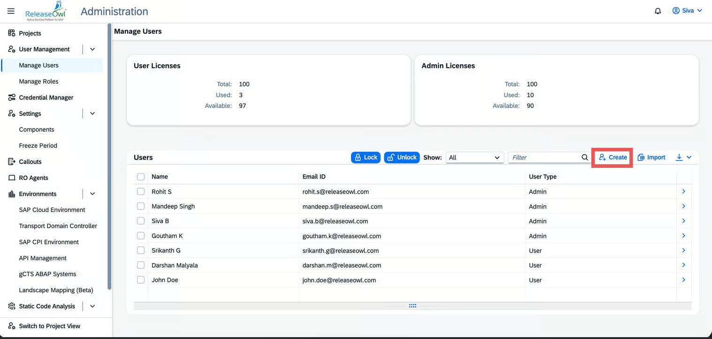

# Credential Management

This section explains how to register and manage credentials required for connecting **ReleaseOwl** with Integration suite, SAP Cloud Identity Services and SAP Passport.

## Credential Management

This section explains how to configure and manage credentials required for integrating **ReleaseOwl with SAP Cloud Platform Integration (CPI)**. Credential management ensures secure communication between ReleaseOwl and SAP systems using both **system-level** and \*\*user-level authentication mechanisms.

## CPI (Cloud Platform Integration)

The CPI domain manages credentials required for securing integration scenarios and internal SAP communications. It supports:

* **System-to-system authentication** (Service Keys)
* **User-based authentication** (Web Authentication)

### Service Keys (System-to-System Authentication)

Service Keys are used for automated, system-level authentication. They allow ReleaseOwl to communicate securely with SAP Integration Suite without any user interaction.

ReleaseOwl requires a **Process Integration Runtime (PIR)** instance in SAP BTP to manage and deploy CPI artifacts. Two PIR service plans are required:

* **API Plan** – for programmatic API access
* **IFLOW Plan** – for managing and testing iFlows

#### 1. Create a PIR Instance with Plan: `API`

**Purpose:**\
This instance enables **programmatic access via APIs** for integration, automation, and artifact management tasks.

#### **Steps:**

1. Log in to your SAP BTP Cockpit.
2. Navigate to your **Global Account > Subaccount**.
3. Go to **Instances and Subscriptions** from the left menu.

<figure><figcaption></figcaption></figure>

4. Click on **Create**.
5. In the "**New Instance or Subscription**" wizard:

* **Service**: SAP Process Integration Runtime
* **Plan**: `api`
* **Runtime Environment**: Cloud Foundry
* **Space**: Select your development space (e.g., `dev`)
* **Instance Name**: Choose a name like `CPI_API_Instance`

6. Click **Next**, then **Create**.

<figure><figcaption></figcaption></figure>


**Note:** The `api` plan provides programmatic access to the SAP Process Integration Runtime, allowing you to connect via APIs for integration tasks.


#### Assign Required Roles

In the **Parameters** step, assign the following roles to allow artifact management:

| **Role**                     | **Description**                                   |
| ---------------------------- | ------------------------------------------------- |
| `MessagePayloadsRead`        | Read message payloads in the integration runtime. |
| `MonitoringDataRead`         | View monitoring data for integration flows.       |
| `TraceConfigurationEdit`     | Edit tracing configurations.                      |
| `TraceConfigurationRead`     | View current tracing configuration.               |
| `WorkspaceArtifactsDeploy`   | Deploy artifacts from workspace to runtime.       |
| `WorkspacePackagesConfigure` | Configure packages, parameters, and dependencies. |
| `WorkspacePackagesRead`      | Read-only access to integration packages.         |
| `WorkspacePackagesEdit`      | Modify and configure integration packages.        |

<figure><figcaption></figcaption></figure>

#### Create Service Key (for `api` plan)

After instance creation:

1. Go to **Instances and Subscriptions**.
2. Expand your newly created `api` instance.
3. Click **Create Service Key**.
4. Enter a name (e.g., `cpi-api-key`) and leave parameters blank.
5. Click **Create**.

<figure><figcaption></figcaption></figure>

6. Click **View Credentials** to retrieve:

* **Client ID**
* **Client Secret**
* **Token URL**

<figure><figcaption></figcaption></figure>

#### Register **SAP CPI (API Access)** Credential in ReleaseOwl

Credential registration enables secure communication between **ReleaseOwl** and **SAP CPI environments.**&#x20;

**✅ Steps:**

1. Log in to the **ReleaseOwl Platform**.
2. Go to **Administration > Credential Manager**.

<figure><figcaption></figcaption></figure>

3. Click **Register Credential**.
4. Fill in the details:
   * **Credential Name:** Any identifiable name for the credential.
   * **Authentication Type:** Select OAuth2
   * **Client ID:** Provide the details from the above created **API service key**.
   * **Client Secret:** Provide the details from the above created **API service key**.
   * **Token URL:** Provide the details from the above created **API service key**.
5. Click **Save**.

The credential will now appear in your list and can be used in pipelines and deployments.

<figure><figcaption></figcaption></figure>

#### 2. Create a PIR Instance with Plan: `IFLOW`

This is used for managing and testing **integration artifacts (iFlows)**.

#### **✅ Steps:**

1. Go to your **SAP BTP Cockpit**.
2. Select your **subaccount** that hosts SAP CPI.
3. Go to **Services > Service Marketplace**.
4. Select **SAP Process Integration Runtime** → Click **Create**.
5. Fill in the following:
   * **Service**: SAP Process Integration Runtime
   * **Plan**: `IFLOW`
   * **Runtime Environment**: Cloud Foundry
   * **Space**: Provide the appropriate space (e.g., `dev`)
   * **Instance Name**: (e.g., `CPI_IFLOW_Instance`)

<figure><figcaption></figcaption></figure>

6. Click **Next** and then **Create**.

<figure><figcaption></figcaption></figure>

#### Create Service Key (for `IFLOW` plan)

The IFlow plan service key is required to execute test cases from ReleaseOwl

1. Navigate to **Instances and Subscriptions**.
2. Locate the `IFLOW` instance.
3. Click **Actions > Create Service Key**.
4. Enter a name for the key (e.g., `cpi-iflow-key`) → Click **Create**.

<figure><figcaption></figcaption></figure>

5. Click on the service key name to view the key details.
6. You will need these values when setting up ReleaseOwl credentials.

<figure><figcaption></figcaption></figure>

#### Register **SAP CPI Credential (Iflow)**  in ReleaseOwl

This step allows **ReleaseOwl** to securely interact with CPI for **artifact deployment** and **management** via the **IFLOW** plan.

**Steps:**

1. Navigate to **Credential Manager** from the **Administration** menu in the **ReleaseOwl** Platform.
2. Click **Register Credential**.
3. Set the **Credential Type** to **SAP Cloud Environment**.
4. Fill in the following details:
   * **Credential Name**: Enter a meaningful name (e.g., `CPI IFLOW Credential`)
   * **Authentication Type**: Select **OAuth2**
   * **Client ID:** Provide the details from the above created IFLOW service key.
   * **Client Secret:** Provide the details from the above created IFLOW service key.
   * **Token URL:** Provide the details from the above created IFLOW service key.
5. Click **Save**.
6. The new credential will now appear in the **List of Credentials** and can be used in Release Pipelines for **IFLOW** deployments.

<figure><figcaption></figcaption></figure>

### **Web Authentication**

Web Authentication is used for interactive and user-based access to SAP services and applications.

**SAP Cloud Identity Services – Identity Authentication (IAS) Instance**&#x20;

It acts as the Identity Provider (IdP) for SAP Integration Suite and is used to authenticate users accessing the platform. It provides browser-based authentication and Single Sign-On (SSO) using the OpenID Connect (OIDC) protocol.

#### **SAP Cloud Identity Service: Create IAS Instance**

1. Navigate to **Instances & Subscriptions** in your SAP BTP subaccount.
2. Click on the **Create** button.
3. In the **Service** field, select **Cloud Identity Services**.
4. In the **Plan** field, choose **Default** under **Subscriptions**, then click **Next**.
5. Click **Create** to provision the instance.

<figure><figcaption></figcaption></figure>

#### **Activate Administrator Account**

1. An **activation email** will be sent to the registered email address.
2. Open the email and click **Activate Account**.
3. Set your password and click on **Continue.**

<figure><figcaption></figcaption></figure>

#### Register SAP Cloud Identity Service Credential in Releaseowl

1. Log in to **ReleaseOwl**.
2. Go to **Administration → Credential Manager**.
3. Click on **Register Credential**.

<figure><figcaption></figcaption></figure>

4. Enter the following information:
   * **Credential Type:** SAP Cloud Identity
   * **User Name:** Cloud Identity Service Username
   * **Password:** Cloud Identity Service Password
5. Click **Save** to complete the credential registration.

<figure><figcaption></figcaption></figure>

#### 2. **SAP Passport:** &#x20;

It enables secure authentication and establishes trusted communication between SAP internal systems and SAP Integration Suite. It ensures system-to-system trust and protects data exchanged across integrated SAP landscapes.

#### Steps to Create SAP Passport

1. Go to **SAP for Me**.
2. Navigate to the **SAP Passport** page (reference link: [_SAP Passport_](https://me.sap.com/app/sappassport)).
3. Enter your **S-User password** when prompted.
4. Click on the **Apply for SAP Passport**.

<figure><figcaption></figcaption></figure>

5. Give your SAP Passport **Password** in that box, then click on **Apply** button your SAP Passport will created.

<figure><figcaption></figcaption></figure>

6. After successful creation, click **Download the SAP Passport**.
7. The passport will be downloaded in **.pfx** format to your system.

<figure><figcaption></figcaption></figure>

#### Register SAP Passport Credential in ReleaseOwl

1. Go to **Credential Manager** in ReleaseOwl.
2. Click **Register Credential**.

<figure><figcaption></figcaption></figure>

3. Fill in the following details:

* **Credential Type:** SAP Passport
* **Password:** Enter the **SAP Passport Password** you provided during the apply process
* **Certificate:** Upload your downloaded **SAP Passport (.pfx)**


**Note:** You **must** keep using the PFX if the server requires client certificate authentication.


4. Save the credential.

<figure><figcaption></figcaption></figure>

