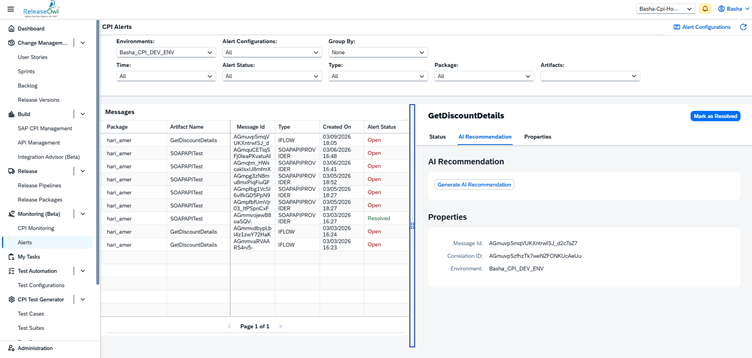

# CPI Monitoring

**CPI Monitoring** in ReleaseOwl enables users to track and manage integration artifacts such as **iFlows, APIs, and messages** from the SAP Integration Suite. It provides visibility into message processing, errors, and performance to ensure integrations run smoothly.

Using this feature, users can:

* Monitor message processing status
* Analyse logs
* Identify failed or retried messages
* Troubleshoot integration issues in real time

#### **SAP CPI Role Requirement**

To read monitoring data in ReleaseOwl, the **“MonitoringDataRead”** role must be assigned in the **SAP Process Integration Runtime (API)** instance.

<figure><figcaption></figcaption></figure>


**Note :**  Without this role, ReleaseOwl will not be able to fetch runtime logs or message processing details.


#### **CPI Environment Configuration in ReleaseOwl**

To enable monitoring:

1. Navigate to the **CPI Environment**.
2. Select the required environment.
3. Under **Advanced Settings**, enable the **Enable Monitoring** checkbox.

<figure><figcaption></figcaption></figure>

### CPI Monitoring Configuration

The **CPI Monitoring Configuration** allows users to configure how monitoring data is fetched from the SAP CPI tenant and displayed in ReleaseOwl.

To view the monitoring configuration:

1. Switch to **Project View**.
2. Navigate to **Monitoring**.
3. Select **CPI Monitoring**.

<figure><figcaption></figcaption></figure>

#### CPI Monitoring Screen

The CPI Monitoring screen provides multiple filters to refine runtime log results:

* **Time** –  The **Time** filter allows users to define the monitoring window for message retrieval.
* **Status** – The **Status** filter allows users to view messages based on their execution outcome.
* **Type** – The **Type** filter defines the artifact category.
* **Package** – The **Package** filter enables users to select a specific CPI package.
* **Artifacts** – The **Artifacts** filter allows users to select one or more specific integration flows (iFlows).

<figure><figcaption></figcaption></figure>


**Note :** Monitoring data is displayed only for projects linked to a configured CPI environment.


#### **Understanding the Monitoring Grid**

The monitoring table displays the following details:

* **Artifact Name** – This column displays the name of the CPI artifact (typically an iFlow) that processed the message.
* **Message ID** – The Message ID is a unique technical identifier assigned to each message execution in CPI.
* **Type** –  This column indicates the artifact type.
* **Started On** – This column shows the exact date and time when the message processing began.
* **Status** – The Status column indicates the current processing state of the message.

<figure><figcaption></figcaption></figure>

*   **Configuration** -  Click **Configuration** to view or modify the **CPI Monitoring configuration settings**. These settings control how monitoring data is fetched from the **SAP CPI tenant** into **ReleaseOwl**. Through this configuration, users can define which messages should be monitored, how many records should be retrieved, and how frequently the monitoring data should be updated.

    <figure><figcaption></figcaption></figure>

The following parameters are available in the configuration:

**Status**\
Specifies the message statuses for which monitoring data will be fetched from the SAP CPI tenant to ReleaseOwl. Only messages with the selected statuses (such as **Failed, Escalated, Retry**, etc.) will be retrieved and displayed in the monitoring dashboard.

**Messages Count**\
Defines the maximum number of monitoring records that will be retrieved during each execution. This helps control the volume of monitoring data fetched from the CPI tenant.

**Time Period**\
This option is used during the **initial execution** to fetch monitoring data starting from the specified **date and time**. It ensures that ReleaseOwl retrieves historical monitoring records from the defined starting point.

**Real Time Monitor**\
When enabled, ReleaseOwl automatically creates a **scheduled job** to periodically fetch monitoring data from the SAP CPI tenant. This allows users to monitor integration messages continuously without manual intervention.

**Schedule Interval (Minutes)**\
Specifies the time interval, in minutes, between each scheduled monitoring data fetch when **Real Time Monitor** is enabled.

**Example:**\
If **Real Time Monitor** is enabled and the **Schedule Interval** is set to **10 minutes**, ReleaseOwl will automatically retrieve monitoring data from the SAP CPI tenant **every 10 minutes** and update the monitoring dashboard accordingly

<figure><figcaption></figcaption></figure>

**Check Messages** -  Click **Check Messages** to manually fetch monitoring data from the CPI tenant. When this option is used, ReleaseOwl retrieves monitoring records from the **last execution time until the current time**. This option is typically used when **Real-Time Monitoring is disabled**.

<figure><figcaption></figcaption></figure>

#### **Viewing Detailed Execution Information**

1. Click on an **Artifact Name** from the monitoring grid.
2. The right-side panel displays detailed information under the following tabs:

**Status**

* Displays execution result.
* Shows error message if processing failed.

**Properties:** Displays runtime metadata and technical properties.

**Artifact Details:** Shows additional artifact-level information related to the execution.

**Refreshing Monitoring Data :** Click the **Refresh** icon to fetch the latest message processing records.

<figure><figcaption></figcaption></figure>

### &#x20;**Alerts**

The **Alerts** feature allows users to configure notifications based on specific **CPI environments** and **monitoring statuses**. When a configured alert condition is triggered, **ReleaseOwl** sends notification emails to the specified users so that integration issues can be addressed quickly. Alerts help teams proactively monitor **integration failures, escalations, or retries**, enabling them to respond promptly and maintain stable integrations.

1. Log in to the **ReleaseOwl Dashboard**.
2. Navigate to: **Monitoring → Alerts**
3. Click on the " **Create Alert Configuration.**"

<figure><figcaption></figcaption></figure>

4. Fill in the following details:&#x20;

* **Name** –  A unique and identifiable name representing the purpose and environment of the alert.
* **Description** – Sends email notifications for failed iFlow executions.
* **Environment** - Select the **CPI environment** for which the alert should be triggered.
* **Active** – Enable the **Active** checkbox to activate the alert.
  * When the alert is **active**, notifications will be sent to users when the alert conditions are triggered.
  * When the alert is **inactive**, notifications will not be sent.
* **Similar Error Notification Interval (Minutes)** –  This setting prevents sending duplicate notifications for the same error repeatedly. If the same artifact generates multiple identical errors within the specified interval, **ReleaseOwl** sends only **one notification** during that time period. **Example:** If the interval is set to **10 minutes** and the same artifact generates **10 identical errors**, only **one notification email** will be sent within those 10 minutes.
* **Notification Email(s):** Specify the email addresses that should receive the alert notifications.
  * Multiple email addresses can be added.
  * Separate each email address with a **comma (,)**.
*   **Artifacts :**  Alerts can be configured to trigger notifications based on specific **Packages** or **Artifacts**. This allows users to:

    * Monitor specific **integration packages**
    * Track failures for particular **integration artifacts**
    * Receive **targeted alerts** only for selected integrations

    This ensures that notifications are sent only for the integrations that require monitoring.

<figure><figcaption></figcaption></figure>

5. After clicking the **Save** button in the Alert Configuration screen, the system redirects to the **CPI Alerts Monitoring** page. This screen displays real-time alert-triggered message details based on the configured alert rules.

<figure><figcaption></figcaption></figure>

#### **Top-Level Filters**

The following filters are available in the CPI Alerts screen to refine and analyze alert-triggered messages:

| **Filter Name**          | **Description**                                                                                                                                                                                                                                                                                                                                                                                                                                                                                                                                                                                                                                                                                                                                                                                                                       |
| ------------------------ | ------------------------------------------------------------------------------------------------------------------------------------------------------------------------------------------------------------------------------------------------------------------------------------------------------------------------------------------------------------------------------------------------------------------------------------------------------------------------------------------------------------------------------------------------------------------------------------------------------------------------------------------------------------------------------------------------------------------------------------------------------------------------------------------------------------------------------------- |
| **Environment**          | Displays the selected CPI environment. Only alerts triggered within the selected environment are shown.                                                                                                                                                                                                                                                                                                                                                                                                                                                                                                                                                                                                                                                                                                                               |
| **Alert Configurations** | Allows selection of a specific alert configuration . The grid displays only the messages that triggered this selected alert rule.                                                                                                                                                                                                                                                                                                                                                                                                                                                                                                                                                                                                                                                                                                     |
| **Group By**             | 
The <strong>Group By</strong> option in the filter section allows users to control how <strong>CPI Monitoring Alerts</strong> are displayed in ReleaseOwl.

Two options are available:

<strong>None</strong> When <strong>None</strong> is selected:
<ul><li>All CPI Monitoring Alerts are displayed <strong>individually</strong>.</li><li>Each alert appears as a <strong>separate record</strong>.</li><li>This view shows the <strong>complete list of alerts without grouping</strong>.</li></ul>
<strong>Error</strong> When <strong>Error</strong> is selected:
<ul><li>Alerts are <strong>grouped based on the error type</strong>.</li><li>Identical errors are grouped together.</li><li>The system displays a <strong>count</strong> showing how many times that error has occurred.</li></ul> |
| **Time**                 | Filters alert records based on the selected time range. Useful for reviewing alerts within a specific monitoring window.                                                                                                                                                                                                                                                                                                                                                                                                                                                                                                                                                                                                                                                                                                              |
| **Alert Status**         | Filters alerts by their current lifecycle status: • **Open** – Alert is active and unresolved. • **Resolved** – Alert has been marked as resolved. • **All** – Displays both Open and Resolved alerts.                                                                                                                                                                                                                                                                                                                                                                                                                                                                                                                                                                                                                                |
| **Type**                 | Filters alerts based on the artifact type.                                                                                                                                                                                                                                                                                                                                                                                                                                                                                                                                                                                                                                                                                                                                                                                            |
| **Package**              | Filters alerts based on the CPI package to which the artifact belongs.                                                                                                                                                                                                                                                                                                                                                                                                                                                                                                                                                                                                                                                                                                                                                                |
| **Artifacts**            | Allows selection of specific artifacts (iFlows) to narrow down alert-triggered messages for targeted analysis.                                                                                                                                                                                                                                                                                                                                                                                                                                                                                                                                                                                                                                                                                                                        |

<figure><figcaption></figcaption></figure>

#### **Messages Grid**

The **Messages** section displays all runtime instances that triggered the configured alert. Each row represents a failed execution that met the alert condition.

**Alert Detail Panel (Right Side)**

When a message row is selected, detailed information appears on the right panel:

**Status Tab**

* Displays failure message.
* Shows error details from CPI runtime.
* Provides technical error information (e.g., HTTP exceptions, adapter errors).

**Generate AI Recommendation**

The **Generate AI Recommendation** feature helps users identify the possible cause of an **artifact failure** using AI-generated insights. When an artifact fails in **CPI Monitoring**, users can click **Generate AI Recommendation** to analyze the failure details.

Once triggered:

* The system analyzes the **error information**.
* An **AI-based recommendation** is generated.
* The recommendation helps determine the **possible cause of the failure** and assists users in troubleshooting the issue more efficiently.

<figure><figcaption></figcaption></figure>

<figure><figcaption></figcaption></figure>

#### Mark as Resolved

Once an issue has been fixed, users can update the alert status by clicking **Mark as Resolved**. When this action is performed, the alert status changes from _**Open**_ to _**Resolved**_, indicating that the issue has been addressed.

**Resolve All Similar Errors :**  If multiple alerts are triggered for the same artifact and similar error, users can resolve them all at once.

* Select the Resolve All Similar Errors checkbox.
* Click on Resolved.

This will automatically resolve all alerts associated with the same artifact and similar error, helping users manage alerts more efficiently and reduce manual effort.

<figure><figcaption></figcaption></figure>

<figure><figcaption></figcaption></figure>

**Viewing Alert Data:** Once an alert is triggered, the corresponding alert information will be available in **ReleaseOwl** for monitoring and analysis. At the same time, notification emails will be sent to the configured users to inform them about the alert. This allows users to quickly review the issue and take the necessary action.

<figure><figcaption></figcaption></figure>

