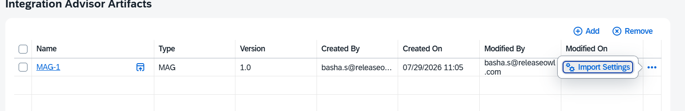

# Automated MTAR Deployments

### Release Pipeline

A Release Pipeline defines how a user story’s changes flow from development to production, including build, merge, validation, approval, and deployment steps. Create or edit pipelines under Release → Release Pipelines. The editor is a five-step wizard:

<table data-header-hidden><thead><tr><th valign="top"></th><th valign="top"></th></tr></thead><tbody><tr><td valign="top">Wizard step</td><td valign="top">Purpose</td></tr><tr><td valign="top">1. Release Pipeline Name</td><td valign="top">Name and basic details of the pipeline.</td></tr><tr><td valign="top">2. Artifact Source</td><td valign="top">The application(s) / source this pipeline promotes.</td></tr><tr><td valign="top">3. Add Stages</td><td valign="top">Define stages (e.g. DEVELOPMENT, QA, PROD) and the ordered tasks in each.</td></tr><tr><td valign="top">4. Triggers</td><td valign="top">How the pipeline is started (promotions are user-initiated / manual).</td></tr><tr><td valign="top">5. Advanced settings</td><td valign="top">Additional pipeline-level options.</td></tr></tbody></table>

**To create a release pipeline:**

1. In **Release**, go to **Release Pipelines.**
2. Click **New Release Pipeline.**

<figure><figcaption></figcaption></figure>

3. A pop-up window will appear where you can choose either **New Build Pipeline** or **Import Build Pipeline**.
4.  If **Import Build Pipeline** is selected:

    * Click **Browse** under **Select JSON File** and upload the exported pipeline configuration file.
    * Enter a name in the **Build Pipeline Name** field.
    * Click **Create** to import the configuration and create the build pipeline.

    <figure><figcaption></figcaption></figure>
5. If **Create New Build Pipeline** is selecte&#x64;**:**
   * You will be redirected to the **Build Pipeline** configuration page, where you can define and configure the pipeline stages and tasks.
6. **Release Pipeline Name:** Give a name for the release pipeline.
7. **Labels:** Labels act as tags for your release pipeline, helping you categorize, organize, and easily search for pipelines. Multiple labels can be added as needed.

<figure><figcaption></figcaption></figure>

8. **Artifact Source:** The dropdown contains all the build pipelines of type **MTAR**. Choose the build pipeline with the necessary artifacts to be deployed in the environment. 

<figure><figcaption></figcaption></figure>

9.  **Add Stages:**  Each stage contains an ordered list of tasks. Within a running pipeline, tasks execute automatically one after another. To pause the pipeline for a manual promotion decision, insert a Wait For Promotion task  at the desired point; human Approval tasks  provide an additional gate.

    In the Feature Branch model the same feature branch is merged into each environment branch as the story advances — the source stays constant and only the Target Environment changes per stage (Development → QA → Production). The development / integration branch is simply the branch mapped to the Development environment; there is no intermediate branch between the feature branch and it.

<figure><figcaption></figcaption></figure>

10. The newly added stage appears as follows:

<figure><figcaption></figcaption></figure>


**Note:** To remove any stage, click **Remove Stage** button.


**Tasks:** Click **Add** to enter any tasks that are to be performed as desired. (Deployment, Approvals, Manual Task, Callout, Test Execution and User Story Status Update)

<figure><figcaption></figcaption></figure>

### Common Source Concepts

Several tasks (Pull Request, Merge, Build) choose their source using a Change/Merge/Build Source setting. The options behave consistently:

<table data-header-hidden><thead><tr><th valign="top"></th><th valign="top"></th></tr></thead><tbody><tr><td valign="top">Source option</td><td valign="top">Meaning</td></tr><tr><td valign="top">Branch / Commits from User Story</td><td valign="top">Uses the feature branch on the user story (Feature Branch model) or the user story’s selected commits (Cherry-Pick model). Each user story is processed individually.</td></tr><tr><td valign="top">Branch from environment</td><td valign="top">Uses the branch mapped to a selected Source Environment. Selecting this reveals an additional Source Environment field. Promotes the whole environment branch (environment-to-environment).</td></tr><tr><td valign="top">Staging branch</td><td valign="top">Uses a staging branch created from the target environment branch . Typically used for Release Package promotion.</td></tr></tbody></table>

### Pull Request Task

Creates a pull request from a source branch to a target branch and delivers a review task to the assigned reviewer.

**Prerequisite — GitLab Token**

The **Pull Request** and **Merge** tasks authenticate to GitLab using the token stored in the project's **Version Control** credential.

Before configuring these tasks, generate a GitLab access token with the required permissions.

1. Log in to GitLab using the service account that ReleaseOwl will use.
2. Go to **Preferences → Access Tokens**. Alternatively, go to **Group/Project → Settings → Access Tokens**.
3. Click **Add new token**.
4. Enter a **Name** and **Expiration date** for the token.
5. In the **Resource and permission selector**, select the **Group and project** tab and enable the following granular permissions:

| Resource                                     | Permissions that MUST be enabled         | If NOT enabled                                                                                                                                                                                                                     |
| -------------------------------------------- | ---------------------------------------- | ---------------------------------------------------------------------------------------------------------------------------------------------------------------------------------------------------------------------------------- |
| Repository → **Code**                        | **Read**                                 | ReleaseOwl cannot read the source and target branches. PR creation fails immediately.                                                                                                                                              |
| Repository → **Commit**                      | **Create, Read, Update**                 | Story commits cannot be read and merge commits cannot be written. The Merge task fails even when the PR is approved.                                                                                                               |
| Repository → **Merge Request**               | **Approve, Create, Merge, Read, Update** | The core of the feature. Without _Create_ the Pull Request task cannot open the PR; without _Read_ it cannot track review status; without _Merge_ the downstream Merge task cannot merge — the pipeline stalls at the merge stage. |
| Repository → **Merge Request Approval Rule** | **Create, Read, Update**                 | Approval state of the PR cannot be evaluated. The Merge task cannot verify the PR is approved before merging.                                                                                                                      |
| Repository → **Branch**                      | **Create, Read**                         | Feature branches cannot be created (Feature Branch model) and environment branches cannot be resolved as PR source/target.                                                                                                         |
| Search → **Global Search**                   | **Use**                                  | Repository and merge request lookup via the search API fails.                                                                                                                                                                      |


**Note:** All the above permissions are mandatory. If any permission is missing, the pipeline may fail at runtime. For example, the Pull Request may not be created, the approval status may not be read, or the Merge task may not be able to merge the pull request.


<figure><figcaption></figcaption></figure>

#### GitLab Webhook Setup

Follow the steps below to configure a webhook for the required GitLab repository.

1. Open the required GitLab repository.
2. Navigate to: **Settings → Webhooks**

<figure><figcaption></figcaption></figure>

3. Click **Add new webhook**.

<figure><figcaption></figcaption></figure>

4. Enter the following details:

* **Name** _(optional)_ – Enter a name for the webhook.
* **Description** _(optional)_ – Enter a description for the webhook.
* **URL** – Enter the webhook URL provided by the application.


**URL :**&#x68;ttps:///ratesaptms/webhook/tenant/{tenantName}/project/{projectID}/pullRequest?rotoken={secretKey}


<figure><figcaption></figcaption></figure>

5. Under **Triggers**, enable: **Merge request events**

<figure><figcaption></figcaption></figure>

6. Make sure **Enable SSL verification** is enabled.
7. Click **Save changes** to create the webhook.

<figure><figcaption></figcaption></figure>

8. After creating the webhook, go to the **Test** section of the webhook configuration.
9. From the **Test** dropdown, select: **Merge request events**
10. Click **Test** to send a test webhook request.

<figure><figcaption></figcaption></figure>

11. Verify that the test request is successfully received by the application and that the webhook connection is established successfully.

#### Bitbucket Webhook Setup

Follow the steps below to configure a webhook for the required Bitbucket repository.

1. Open Bitbucket and locate the required repository, for example, under **Repositories** in the left sidebar.
2. Click the **⋯ (More options)** menu next to the repository name and select **Settings**.

<figure><figcaption></figcaption></figure>

3. In the **Repository details** section, enter the repository name and select the required project.

<figure><figcaption></figcaption></figure>

4. In the repository settings, navigate to **Workflow** and select **Webhooks**.

<figure><figcaption></figcaption></figure>

5. Enter the following details:
   * **Title (Optional):** Enter a name for the webhook.
   *   **URL:** Enter the webhook URL provided by the application.

       `https://<host>/ratesaptms/webhook/tenant/{tenantName}/project/{projectID}/pullRequest?rotoken={secretKey}`
6. In the **Status** section, select the **Active** checkbox.
7. In the **Triggers** section, under **Pull Request**, select the **Approved** checkbox.
8. Click **Save**.

<figure><figcaption></figcaption></figure>

#### &#x20;Azure DevOps Webhook Setup

Follow the steps below to configure a webhook in Azure DevOps.

1. Go to **Project Settings** in the required Azure DevOps project.

<figure><figcaption></figcaption></figure>

2. In **Project Settings**, select **Service Hooks**.

<figure><figcaption></figcaption></figure>

3. Click the **+** button to create a new service hook.

<figure><figcaption></figcaption></figure>

4. Select **Webhooks** and click **Next**.

<figure><figcaption></figcaption></figure>

5. Select the required repository and the trigger for the event, which is **Pull Request Updated**. Click **Next**.

<figure><figcaption></figcaption></figure>

6.  &#x20;In the **Settings** section, enter the following URL:

    `https://<host>/ratesaptms/webhook/tenant/{tenantName}/project/{projectID}/pullRequest?rotoken={secretKey}`&#x20;
7. Click **Next**.

<figure><figcaption></figcaption></figure>

8. Fill in the required details and click **Test**.

<figure><figcaption></figcaption></figure>

9. A **Success** message is displayed when the webhook configuration is tested successfully.

<figure><figcaption></figcaption></figure>

#### Github Setup

Follow the steps below to configure a webhook for the required GitHub repository.

1. Open the required repository in GitHub.
2. Go to **Settings** and select **Webhooks** from the left navigation.
3. Click **Add webhook**.

<figure><figcaption></figcaption></figure>

4. In the **Payload URL** field, enter the webhook URL provided by the application:

`https://<host>/ratesaptms/webhook/tenant/{tenantName}/project/{projectID}/pullRequest?rotoken={secretKey}`

5. Set **Content type** to **application/json**.

<figure><figcaption></figcaption></figure>

6. Under **Which events would you like to trigger this webhook?**, select **Let me select individual events**.
7. Select **Pull request reviews** as the event to trigger the webhook.
8. Ensure that **Active** is selected to enable the webhook.
9. Click **Add webhook** to save the configuration.

<figure><figcaption></figcaption></figure> <figure><figcaption></figcaption></figure>

#### &#x20;Configure the Required Scopes

Follow the steps below to create a GitHub Personal Access Token (classic) with the required scopes.

1. Sign in to GitHub and click your profile picture in the upper-right corner.
2. Select **Settings**.

<figure><figcaption></figcaption></figure>

3. In the left navigation, scroll down and select **Developer settings**.

<figure><figcaption></figcaption></figure>

4. Under **Developer settings**, select **Personal access tokens** and then select **Tokens (classic)**.

<figure><figcaption></figcaption></figure>

5. On the **Tokens (classic)** page, click **Generate new token** and select **Generate new token (classic)**.

<figure><figcaption></figcaption></figure>

6. Under **Select scopes**, select the scopes required by the application, as shown in the following image.

<figure><figcaption></figcaption></figure> <figure><figcaption></figcaption></figure>

**Configure the Pull Request Task**

Configure the following fields when adding the **Pull Request Task** to the release pipeline:

| **Field**                       | **Type**    | **Description**                                                                                                                                                                                                                                                                                                            |
| ------------------------------- | ----------- | -------------------------------------------------------------------------------------------------------------------------------------------------------------------------------------------------------------------------------------------------------------------------------------------------------------------------- |
| Name                            | Text        | Task name.                                                                                                                                                                                                                                                                                                                 |
| Description                     | Text        | Task description.                                                                                                                                                                                                                                                                                                          |
| Change Source                   | Dropdown    | Branch from User Story (typical for Feature Branch model — PR from the story’s feature branch to the target environment branch) or Branch from environment (PR from a Source Environment branch to the target environment branch; used for Release Package promotions). A Source Environment field appears for the latter. |
| Target Environment              | Dropdown    | The environment whose branch is the PR target.                                                                                                                                                                                                                                                                             |
| Assign To                       | Role / User | Who receives the review task (a Role or a specific User) — same as the Approval task.                                                                                                                                                                                                                                      |
| Promoter cannot be the approver | Checkbox    | Prevents the person promoting from approving their own change.                                                                                                                                                                                                                                                             |
| Disable email notification      | Checkbox    | Suppresses the notification email.                                                                                                                                                                                                                                                                                         |
| Approval message required       | Checkbox    | Requires a message on completion.                                                                                                                                                                                                                                                                                          |
| Message                         | Rich text   | Instruction shown to the reviewer.                                                                                                                                                                                                                                                                                         |

**How it works (Feature Branch model)**: The reviewer receives a task in My Tasks, opens the pull request directly in the Git repository, and approves it there — they do not merge it in Git. The actual merge is performed by the downstream Merge task in the pipeline. The reviewer then returns to ReleaseOwl and completes the Pull Request task, and the pipeline continues. Completion can also be automated with a Git webhook.


**Behavior**:  If a reviewer merges the pull request directly in Git instead of only approving, the downstream Merge task still runs but finds no changes to merge — it completes without error.


<figure><figcaption></figcaption></figure>

### Merge Task

Merges changes from a source branch into a target branch. The source and target branches are resolved at runtime from the task configuration.

| **Field**                  | **Type**            | **Description**                                                                                                                        |
| -------------------------- | ------------------- | -------------------------------------------------------------------------------------------------------------------------------------- |
| Name / Description         | Text                | Task identity.                                                                                                                         |
| Merge Source               | Dropdown            | Branch/Commits from User Story, Branch from environment, or Staging branch.                                                            |
| Target Environment         | Dropdown            | The environment whose branch receives the merge.                                                                                       |
| Notify Users               | Checkbox            | Send notifications on completion.                                                                                                      |
| Create Staging Branch for  | Dropdown (Advanced) | None, Release Package, or Both — whether a staging branch is created (from the target environment branch) instead of merging directly. |
| Execute this task only for | Dropdown (Advanced) | User Story, Release Package, or Both — scopes the task to the relevant promotion mode.                                                 |

By default the source changes are merged directly into the target environment branch. When staging is enabled, changes are merged into a staging branch cut from the target environment branch instead; a later Merge task then promotes the staging branch into the target environment branch. Creating a staging branch is optional — configure the Merge and Build tasks to match your requirement.

<figure><figcaption></figcaption></figure>

### Build Task

Builds the application code using the Build Pipeline configured in ReleaseOwl, producing the MTAR artifact.

| **Field**                                             | **Type** | **Description**                                                                                                                                                               |
| ----------------------------------------------------- | -------- | ----------------------------------------------------------------------------------------------------------------------------------------------------------------------------- |
| Name / Description                                    | Text     | Task identity.                                                                                                                                                                |
| Build Source                                          | Dropdown | Branch from User Story, Branch from environment (reveals a Source Environment), or Staging branch .                                                                           |
| Select Environment(s)                                 | Dropdown | The environment whose configured Build Pipeline is used to build.                                                                                                             |
| Use Different Settings for Build from Release Package | Checkbox | Lets User Story builds and Release Package builds use different sources (e.g. User Story builds from the environment branch, Release Package builds from the staging branch). |
| Notify Users                                          | Checkbox | Send notifications on completion.                                                                                                                                             |

The per-environment Build Pipeline (from the landscape) is used for fixed environment branches. For dynamic branches — hotfix branches and staging branches — the Build task uses the application’s dynamic build pipeline.

<figure><figcaption></figcaption></figure>

### Validate Task (optional)

Presents the results of the static code checks that were executed as part of the Build task. The Validate task itself does not run the scan — it reads and displays the validation report.

| **Field**               | **Type**                      | **Description**                                          |
| ----------------------- | ----------------------------- | -------------------------------------------------------- |
| Name/ Description       | Text                          | Task identity.                                           |
| Select Build Task       | Dropdown                      | The Build task whose static-code-check results are read. |
| Target                  | Dropdown                      | The target environment.                                  |
| User story Dependencies | Checkbox (Quality Checks)     | Optionally validate user-story dependencies.             |
| Continue on Failure     | Checkbox (Pipeline Execution) | Allow the pipeline to proceed even if validation fails.  |

<figure><figcaption></figcaption></figure>

### Approval Task

A human gate that pauses the pipeline until the assigned Role or User approves the deployment. Assignment and options (Promoter cannot be the approver, Disable email notification, Approval message required, Message) mirror the Pull Request task’s assignment settings. The approver receives the task in My Tasks.

<figure><figcaption></figcaption></figure>

### Deployment Task

Deploys the built MTAR artifact to the target SAP Cloud environment.

| **Field**                                     | **Type** | **Description**                                                      |
| --------------------------------------------- | -------- | -------------------------------------------------------------------- |
| Name/ Description                             | Text     | Task identity.                                                       |
| Select Environment(s)                         | Dropdown | The target environment to deploy to.                                 |
| Select Build Task                             | Dropdown | The Build task whose artifact is deployed.                           |
| Upload Artifact to Cloud Transport Management | Checkbox | Optionally upload the MTAR to SAP Cloud Transport Management (CTMS). |
| Keep Logs for (Days)                          | Number   | Retention period for deployment logs.                                |
| Notify Users / Notify Promotion User          | Checkbox | Notification options.                                                |
| Schedule Time                                 | Checkbox | Schedule the deployment for a later time.                            |

The MTA extension files applied at deployment are taken from those associated with the target environment in the Landscape Configuration.

<figure><figcaption></figcaption></figure>

### Update User Story Status task (“Stage Done”)

Updates the status of the user stories processed by the stage (for example, marking DEVELOPMENT as done). Typically the last task in a stage.

<figure><figcaption></figcaption></figure>

### Wait For Promotion Task

Halts the pipeline at this point and waits for the user to manually promote. Because tasks otherwise run automatically in sequence, this task is how manual stage-gating is implemented — insert it wherever the pipeline should stop and wait for an explicit promotion decision.

<figure><figcaption></figcaption></figure>


**Note:** If the Release Pipeline fails, the logs are also attached in the notification email. By default, the user who creates the Release Pipeline is notified and specifying the distribution list is optional.


### **Post-Creation Options**

Once the Release Pipeline is created, you can use the **Actions** button for the following options:

**Save As**:  Opens a popup where you can enter a new name and create a copy of the pipeline.

<figure><figcaption></figcaption></figure>

**Versions**: Displays all versions for the selected Release Pipeline. This option helps users track generated versions of the **Release Pipeline**. Versions are displayed only after the **Release Pipeline** has been promoted for the corresponding user story.

To view a specific version:

1. Select the required version from the created Release Pipeline list.

<figure><figcaption></figcaption></figure>

2. Click the **Actions (⋯)** button for that version.
3. Select **View**.

This allows you to view the details of the selected version of the release pipeline.

**Delete:** Deletes an existing release pipeline from the system.

<figure><figcaption></figcaption></figure>

**Archive** : The **Archive** option is available, which archives the project instead of deleting it.

<figure><figcaption></figcaption></figure>

**Export Release Pipeline:** It is the process of downloading the complete configuration of an existing release pipeline as a file (usually in **JSON format**) so it can be reused, shared, or backed up.

1. Navigate to the **Release Pipelines** section.
2. Select the existing pipeline you want to reuse.
3. Click **Export Release Pipeline**.
4. The pipeline configuration is downloaded as a **JSON file** to your local system.

<figure><figcaption></figcaption></figure>

### **Multi-Stage Release Pipeline**

Any number of stages can be added while creating a release pipeline. An existing release pipeline can also be edited to include various stages. This is required when we want the deployments to take place in multiple environments one after the other continuously which is a part of Continuous Delivery.&#x20;

For each stage, the tasks are to be added separately. This corresponds to the tasks that are to be performed in that particular environment for the deployment to take place and the required actions that are to be taken. 

<figure><figcaption></figcaption></figure>

**Running a Release Pipeline**

Once a release pipeline is created, you can run multiple iterations to deploy MTAR artifacts.

To run a release pipeline:

1\. Once you create a release package, go to **Release**, and click **Release Pipeline.**

2\. Choose the required release pipeline to be run and click **Run.**

<figure><figcaption></figcaption></figure>

3\. A pop-up appears. Enter a **Cycle Name** and **Select build** from the drop down.

<figure><figcaption></figcaption></figure>

4\. Click **Trigger Pipeline.** A message is displayed, about successful creation of a release pipeline. Click OK. The following screen is displayed:

<figure><figcaption></figcaption></figure>

5. Click **Refresh** to view the newly triggered cycle.
6. Select the required **Build** to view the list of triggered cycles.

<figure><figcaption></figcaption></figure>

7. Click the **Expand** (arrow) icon for the required cycle to view its details.

<figure><figcaption></figcaption></figure>

8. Select the required cycle to navigate to **Pipeline Activity**, where you can monitor the pipeline execution and view the status of each stage.

<figure><figcaption></figcaption></figure>

**Editing a Release Pipeline**

* Navigate to the **Release Pipelines** page.
* Open the required Release Pipeline.
* Click **Edit** to modify the pipeline configuration.

<figure><figcaption></figcaption></figure>


**Note :**  Users can now promote builds directly from the [**User Story**](https://releaseowl.gitbook.io/releaseowl-docs/releaseowl-user-guide/sap-btp/working-with-user-stories) and **Release Package** sections without navigating to the Build Pipelines module.


#### Configure the Required Scopes

Follow the steps below to create a GitHub Personal Access Token (classic) with the required scopes.

1. Sign in to GitHub and click your profile picture in the upper-right corner.
2. Select **Settings**.

<figure><figcaption></figcaption></figure>

3. In the left navigation, scroll down and select **Developer settings**.

<figure><figcaption></figcaption></figure>

4. Under **Developer settings**, select **Personal access tokens** and then select **Tokens (classic)**.

<figure><figcaption></figcaption></figure>

5. On the **Tokens (classic)** page, click **Generate new token** and select **Generate new token (classic)**.

<figure><figcaption></figcaption></figure>

6. Under **Select scopes**, select the scopes required by the application, as shown in the following image.

<figure><figcaption></figcaption></figure> <figure><figcaption></figcaption></figure>

